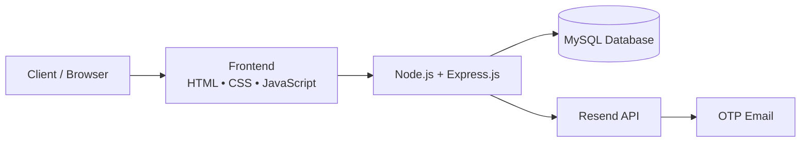

# NEXUS Bank

NEXUS Bank is a full-stack online banking application that simulates core banking operations such as customer onboarding, account management, money transfers, beneficiaries, fixed deposits, and transaction statements.

## 🌐 Live Demo

**[NEXUS Bank – Live Application](https://nexus-bank-live-production-f31e.up.railway.app/)**

**[GitHub Repository](https://github.com/rkanjana/nexus-bank-live)**

## ✨ Features

### Customer

- Account registration with email OTP verification
- Automatic account number generation
- Secure login and session-based authentication
- Profile management
- Money transfers
- Beneficiary management
- Fixed deposits
- Transaction statements

### Employee & Manager

- Employee authentication
- Employee operations and requests
- Manager approval workflows

## 🛠️ Tech Stack

| Layer | Technologies |
|---|---|
| Frontend | HTML5, CSS3, JavaScript |
| Backend | Node.js, Express.js |
| Database | MySQL |
| Authentication | Express Session, bcrypt |
| Email / OTP | Resend API |
| Deployment | Railway |

## 🏗️ Architecture



## 🔄 Application Flow

```text
Customer Registration
        ↓
Email OTP Verification
        ↓
Account Creation
        ↓
Customer Login
        ↓
Banking Dashboard
   ┌────┼────────────┬──────────────┐
   ↓    ↓            ↓              ↓
Transfer  Beneficiaries  Fixed Deposits  Statements
```

## ⚙️ Local Setup

### 1. Clone the repository

```bash
git clone https://github.com/rkanjana/nexus-bank-live.git
cd nexus-bank-live
```

### 2. Install dependencies

```bash
npm install
```

### 3. Configure environment variables

Create a `.env` file using `.env.example` and configure the required database, Resend API, session, and application settings.

### 4. Set up the database

Create the required MySQL database and run the schema provided in:

```text
SQL files/schema.sql
```

### 5. Start the application

```bash
npm start
```

The application will run on the configured port.

> **Security:** API keys, database credentials, session secrets, and other sensitive configuration are stored using environment variables and are not committed to the repository.

## 🚀 Deployment

The application is deployed on **Railway**.

- **Application Hosting:** Railway
- **Database:** MySQL
- **OTP Delivery:** Resend API
- **Configuration:** Environment variables

## 📌 Future Improvements

- Persistent OTP storage using Redis or a database
- Production-ready session storage
- Domain-based email sending
- Expanded banking services such as loans and credit cards
